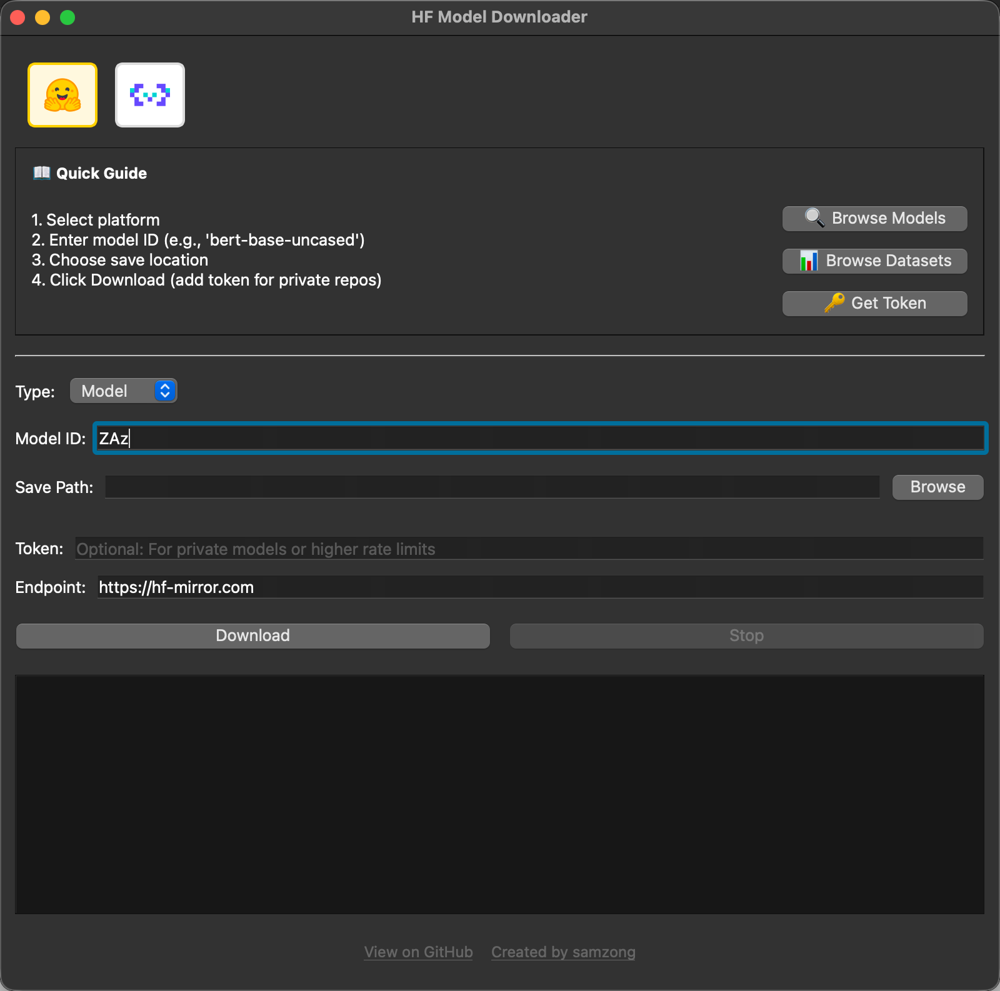

# hf-model-downloader

<div align="center">
  
  <br />

  <p>
    <a href="./README.md">English</a> | <strong>简体中文</strong>
  </p>

  <div id="download-section" style="margin: 20px 0;">
    <a href="https://github.com/guozhijian611/hf-model-downloader/releases" style="text-decoration: none;">
      
    </a>
  </div>

  <br />
  <p>从 Hugging Face 和 ModelScope 下载模型与数据集。图形界面操作，无需折腾命令行。</p>
  <p>
    <a href="https://github.com/guozhijian611/hf-model-downloader/releases"></a>
    <a href="https://github.com/guozhijian611/hf-model-downloader/blob/main/LICENSE"></a>
    <a href="https://deepwiki.com/guozhijian611//hf-model-downloader"></a>
  </p>
</div>



## 项目简介

`hf-model-downloader` 是一个跨平台桌面应用，用 PyQt6 提供简洁 GUI，帮你从：

- **Hugging Face**（默认走国内友好镜像 `hf-mirror.com`）
- **ModelScope**（魔搭社区）

下载 **模型（Model）** 或 **数据集（Dataset）**。支持 Token 鉴权、实时进度与日志、中断下载，并通过 PyInstaller 打包成可独立运行的安装包。

当前版本：**0.8.0**（见 `pyproject.toml`）。

## 主要功能

- 图形界面选择平台（Hugging Face / ModelScope）
- 支持模型与数据集两类仓库
- 可选 Token，用于私有仓库或提高限流额度
- 可自定义 Endpoint（HF 默认镜像、ModelScope 官方站）
- **代理设置**：支持 HTTP/HTTPS/SOCKS 代理（如 `http://127.0.0.1:7890`）
- **在线检查 / 自动更新**：从 GitHub Releases 检测新版本，可自动下载安装包并解压替换当前程序
- **记住上次输入**：平台、类型、模型 ID、保存路径、Token、Endpoint、代理等自动恢复
- 实时下载日志与进度展示
- 支持停止/取消下载
- 集成 `huggingface-hub[hf_xet]`，在可用时提升大文件下载效率
- 下载前校验仓库类型（避免把 Dataset ID 当 Model 下等）
- Windows / macOS / Linux 均可使用
- 可打包为独立应用，无需本机配置 Python 环境

## 使用方式（普通用户）

从 [Releases](https://github.com/guozhijian611/hf-model-downloader/releases) 下载对应系统的安装包，打开即可使用。

**操作步骤：**

1. 选择平台（Hugging Face 或 ModelScope）
2. 选择类型（Model 或 Dataset）
3. 填写仓库 ID（例如 `qwen/Qwen2.5-Coder-1.5B-Instruct`）
4. 选择保存目录
5. 如需私有仓库访问，填写 Token
6. 如需代理，勾选 **Enable** 并填写代理地址（例如 `http://127.0.0.1:7890`）
7. 点击 **Download** 开始下载

表单内容会在下载或关闭窗口时自动保存，下次打开自动恢复。

界面内提供「浏览模型 / 浏览数据集 / 获取 Token」快捷入口，会打开对应平台网页。

## 开发环境

依赖 [uv](https://docs.astral.sh/uv/) 管理 Python 环境（要求 Python ≥ 3.13）。

```bash
git clone https://github.com/guozhijian611/hf-model-downloader.git
cd hf-model-downloader

uv sync          # 安装依赖（含 huggingface-hub[hf_xet]）
uv run main.py   # 启动应用
# 或
make dev
```

## 构建

```bash
# 构建应用
make build

# 生成 DMG 安装包（仅 macOS）
make dmg

# 清理构建产物
make clean
```

## 代码质量

```bash
make format      # 格式化代码
make lint        # 代码检查
make lint-fix    # 自动修复可修问题
make test        # 快速冒烟测试（含 Xet 可用性等）
make test-e2e    # 完整下载测试（需要网络）
make check       # format + lint + test + build
```

## 发布

```bash
# 预览下一版本
make release-dry-run

# 创建正式发布（仅 main 分支）
make release
```

查看全部 Make 命令：

```bash
make help
```

## 项目结构（简要）

```
hf-model-downloader/
├── main.py                 # 应用入口
├── build.py                # PyInstaller 打包脚本
├── src/
│   ├── ui.py               # 主界面
│   ├── app_settings.py     # 记住上次输入（QSettings）
│   ├── proxy_env.py        # 代理环境变量工具
│   ├── unified_downloader.py  # 统一下载逻辑（HF + ModelScope）
│   ├── hf_hub_env.py       # HF 环境变量 / 镜像 / Xet
│   ├── hf_repo_validate.py # 仓库类型校验
│   ├── downloader.py       # 兼容旧接口的 HF 封装
│   ├── modelscope_downloader.py  # 兼容旧接口的 ModelScope 封装
│   ├── resource_utils.py   # 资源路径（开发/打包）
│   └── utils.py            # 清理锁文件等工具
├── tests/                  # 单元与 e2e 测试
├── assets/                 # 图标与品牌资源
└── .github/workflows/      # CI：多平台构建、发布、Homebrew 等
```

## 技术栈

| 类别 | 技术 |
|------|------|
| GUI | PyQt6 |
| 下载 | huggingface-hub（含 hf_xet）、modelscope |
| 打包 | PyInstaller、dmgbuild（macOS）、NSIS（Windows） |
| 依赖管理 | uv |
| 代码质量 | ruff、pytest |
| 版本发布 | python-semantic-release |

## 许可证

基于 [MIT License](LICENSE) 开源。
